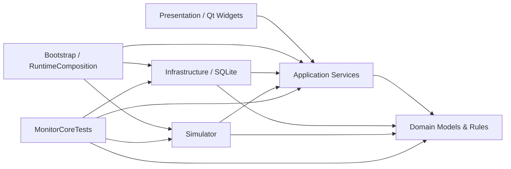
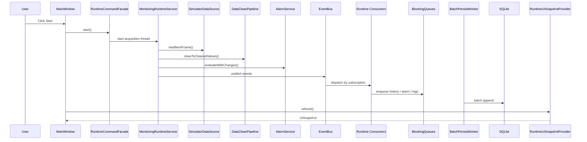
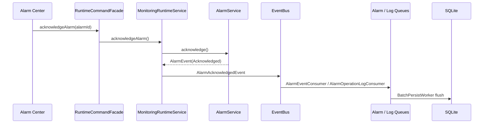

# MonitorQT

## 项目简介

MonitorQT 是一个基于 Qt6 Widgets、C++17 和 CMake 构建的多通道测量仪器监控桌面应用。项目目标是将原 WPF / C# 上位机监控 Demo 迁移为 Qt/C++ 实现，并保留完整的数据采集、数据清洗、告警评估、事件分发、批量持久化和 UI 可视化链路。

项目内置模拟数据源，用于持续生成设备状态、温度、压力、光强、电压、电流、振动以及 16 x 16 光强矩阵数据。原始设备帧会被转换为统一的 Tag 运行时状态，并驱动 Dashboard、实时 Tag、趋势图、告警中心、历史查询、矩阵热力图和日志设置页面。

该项目适合作为 Qt 桌面应用、工业监控上位机、分层架构、事件驱动、SQLite 本地持久化和 C# 到 Qt/C++ 迁移的学习或作品集展示案例。根据当前代码推测，项目定位为可运行的模拟监控 Demo，而非直接面向生产现场的工业控制系统。

项目中暂未发现真实 Modbus、串口、TCP、厂商 SDK、用户认证、网络 API、容器化部署或生产安装器相关实现。

## 核心功能

- 内置多通道虚拟设备，默认设备 ID 为 `MCMD-001`。
- 生成温度、压力、光强、电压、电流、振动 6 类通道数据。
- 生成 16 x 16 矩阵数据，并支持热点、低值区、离线、告警等模拟场景。
- 将原始帧映射为 22 个默认业务 Tag 和 22 个数据源映射。
- 计算功率、负载率、矩阵均值、最大值、最小值、均匀性、异常点数量和热点坐标。
- 基于质量状态和高低阈值执行告警评估。
- 支持告警触发、更新、确认、恢复等生命周期。
- 使用事件总线分发 RawFrame、Tag 状态、告警和数据源健康事件。
- 使用内存缓存维护当前 Tag 快照、趋势窗口和最新矩阵帧。
- 使用后台队列和批量 Worker 写入历史、告警和操作日志。
- 使用 SQLite 持久化历史采样、告警事件、操作日志、运行参数和 Tag 运行配置。
- 提供 Dashboard、Realtime Tags、Trend、Alarm Center、History、Measurement Map、Logs & Settings 七个 Qt 页面。
- 支持趋势、历史和矩阵数据 CSV 导出。
- 支持 UI 通过 `RuntimeUiSnapshotProvider` 读取统一快照，而不是直接读设备或数据库。
- 支持应用启动时 SQLite 初始化、schema migration、历史保留清理和退出 flush。

## 技术栈

| 技术 | 用途 | 项目中的体现位置 |
| --- | --- | --- |
| C++17 | 核心语言、领域模型、运行时服务 | `domain/`、`application/`、`simulator/` |
| Qt6 Core | 时间、容器、线程、信号槽、UUID | 全局使用 |
| Qt6 Widgets | 桌面 UI、主窗口、页面、表格、自绘图形 | `mainwindow.*`、`presentation/pages/`、`shell/` |
| Qt6 Sql | SQLite 连接和查询 | `infrastructure/persistence/` |
| Qt LinguistTools | 翻译文件生成 | `MonitorQT_zh_CN.ts`、`CMakeLists.txt` |
| CMake | 构建系统、静态库分层、测试注册 | `CMakeLists.txt` |
| SQLite / QSQLITE | 本地历史、告警、日志和配置持久化 | `SqliteConnectionFactory.*`、`SqliteSchemaMigrations.*` |
| `std::thread` / `std::atomic` | 采集线程和后台持久化 Worker | `application/runtime/`、`application/workers/` |
| `QMutex` / `QWaitCondition` | 线程安全缓存和阻塞队列 | `application/caches/`、`application/queues/` |
| `QPainter` | 趋势图和矩阵热力图自绘 | `presentation/pages/MonitoringPages.*` |
| `QTextStream` / `QFile` | UTF-8 BOM CSV 导出 | `presentation/export/CsvExportWriter.*` |
| 自定义控制台测试 | 核心逻辑集成测试 | `tests/MonitorCoreTests.cpp` |
| AGPL-3.0 | 开源许可证 | `LICENSE.txt` |

## 项目架构

项目采用清晰的分层架构，整体依赖方向以 Domain 和 Application 为中心。Qt UI、SQLite、模拟器和组合根都作为外围模块存在。



运行时主链路：



## 目录结构

```text
MonitorQT/
├── CMakeLists.txt                  # CMake 构建入口
├── main.cpp                        # Qt 应用入口、SQLite 校验、运行时组合根启动
├── mainwindow.*                    # 主窗口、页面创建、导航、Start/Stop、定时刷新
├── MonitorQT_zh_CN.ts              # Qt 翻译源文件
├── LICENSE.txt                     # GNU AGPL v3
├── build_cmd.txt                   # 本地构建/运行命令示例
├── domain/                         # 领域模型和领域规则
│   ├── alarms/
│   ├── common/
│   ├── devices/
│   ├── logs/
│   ├── measurements/
│   ├── rules/
│   ├── tags/
│   └── tasks/
├── application/                    # 应用服务、DTO、事件、队列、运行时和 Worker
│   ├── abstractions/
│   ├── caches/
│   ├── configuration/
│   ├── dto/
│   ├── events/
│   ├── pipelines/
│   ├── queues/
│   ├── runtime/
│   ├── services/
│   └── workers/
├── infrastructure/                 # SQLite 仓储、迁移、连接工厂、历史保留
│   └── persistence/
├── simulator/                      # 模拟数据源、通道/矩阵生成器、场景和设备 Profile
│   ├── adapters/
│   ├── generators/
│   ├── models/
│   ├── noise/
│   ├── profiles/
│   └── scenarios/
├── bootstrap/                      # RuntimeComposition、事件注册、应用运行时 Host
├── presentation/                   # Qt 表现层页面和导出工具
│   ├── export/
│   └── pages/
├── navigation/                     # 页面枚举和 QStackedWidget 导航服务
├── shell/                          # 顶部状态栏、侧边导航、底部状态栏
├── pages/                          # 旧占位页组件
├── phase0/                         # 源项目行为冻结与验收契约
├── tests/                          # MonitorCoreTests 控制台测试
├── mydoc/                          # 迁移、设计、检查文档
└── MyProject/                      # 原 WPF/C# 参考工程，当前作为 reference folder
```

## 核心模块说明

### Domain

模块职责：定义稳定的业务语言和规则，不依赖 Qt Widgets、SQLite 或模拟器实现。

关键文件：

- `domain/common/DomainCommon.*`
- `domain/tags/TagModels.*`
- `domain/measurements/MeasurementModels.*`
- `domain/alarms/AlarmModels.*`
- `domain/rules/DomainRules.*`
- `domain/rules/MatrixStatisticsCalculator.*`

主要类 / 结构：

- `RawMeasurementFrame`：设备侧原始帧。
- `MatrixFrame`：矩阵数据与统计入口。
- `TagDefinition`、`TagSourceMapping`、`TagRuntimeState`、`TagValue`：统一 Tag 模型。
- `AlarmDefinition`、`AlarmEvent`：告警定义和生命周期事件。
- `UtcDateTime`：UTC 时间契约和 C# ticks 转换。

与其他模块关系：Application 依赖 Domain；Infrastructure 和 Simulator 也复用 Domain 值对象。

### Application

模块职责：承载数据清洗、配置、事件、缓存、运行时编排、查询服务和 UI 快照聚合。

关键文件：

- `application/pipelines/DataCleanPipeline.*`
- `application/services/AlarmService.*`
- `application/services/TagDefinitionCatalog.*`
- `application/services/RuntimeCommandFacade.*`
- `application/services/RuntimeUiSnapshotProvider.*`
- `application/services/RuntimeEventConsumers.*`
- `application/runtime/MonitoringRuntimeService.*`
- `application/runtime/RuntimeLifecycleCoordinator.*`
- `application/runtime/PersistenceRuntimeCoordinator.*`
- `application/workers/BatchPersistWorker.h`

主要类 / 函数：

- `DataCleanPipeline`：把原始帧转换为清洗后的 Tag 值。
- `AlarmService`：基于 Tag 质量和阈值维护告警生命周期。
- `EventBus`：支持 `Critical` 和 `Isolated` 失败策略的事件分发。
- `RuntimeCommandFacade`：面向 UI 的 Start、Stop、确认告警、保存配置入口。
- `RuntimeUiSnapshotProvider`：将运行时状态、缓存和配置组合为 `UiSnapshot`。
- `BatchPersistWorker<T>`：定时或按批量大小刷写队列。

与其他模块关系：向上被 UI/Bootstrap 调用，向下依赖 Domain，不直接依赖 Qt Widgets。

### Infrastructure

模块职责：提供 SQLite 持久化实现、schema 迁移、连接管理和历史保留任务。

关键文件：

- `infrastructure/persistence/SqliteConnectionFactory.*`
- `infrastructure/persistence/SqliteSchemaMigrations.*`
- `infrastructure/persistence/SQLiteHistoryRepository.*`
- `infrastructure/persistence/SQLiteAlarmRepository.*`
- `infrastructure/persistence/SQLiteOperationLogRepository.*`
- `infrastructure/persistence/SQLiteConfigurationRepository.*`
- `infrastructure/persistence/HistoryRetentionService.*`

SQLite 表：

| 表 | 用途 |
| --- | --- |
| `schema_migrations` | 记录迁移版本 |
| `history_samples` | Tag 历史值 |
| `alarm_events` | 告警生命周期事件 |
| `operation_logs` | 业务操作日志 |
| `tag_runtime_settings` | Tag 阈值、告警开关、历史策略 |
| `runtime_settings` | 运行时参数键值 |

当前 schema version 为 `5`。默认数据库路径为应用输出目录下的 `data/multichannel-monitor.db`。

### Simulator

模块职责：生成可重复的模拟仪器数据，用于无硬件环境下演示完整链路。

关键文件：

- `simulator/adapters/SimulatorDataSource.*`
- `simulator/generators/FakeDataGenerator.*`
- `simulator/generators/ChannelValueGenerator.*`
- `simulator/generators/MatrixValueGenerator.*`
- `simulator/scenarios/SimulationScenario.*`
- `simulator/profiles/DefaultInstrumentProfile.*`

主要能力：

- 正常场景。
- 离线场景。
- 矩阵热点场景。
- 告警场景。
- Demo 周期性异常场景。

与其他模块关系：`SimulatorDataSource` 实现 Application 层的 `IRawFrameSource`，可在后续替换为真实设备适配器。

### Bootstrap

模块职责：作为组合根创建完整对象图，并管理应用级生命周期。

关键文件：

- `bootstrap/RuntimeComposition.*`
- `bootstrap/RuntimeCompositionDependencies.*`
- `bootstrap/ApplicationRuntimeHost.*`
- `bootstrap/EventRegistration.*`

主要职责：

- 初始化 SQLite。
- 加载运行配置和 Tag 配置。
- 创建 Application 服务、队列、Worker、事件消费者。
- 注册事件订阅和 handler。
- 创建 `RuntimeCommandFacade` 与 `RuntimeUiSnapshotProvider`。
- 启动持久化 Worker。
- 应用启动时执行历史保留清理。
- 应用退出时停止采集、flush 队列并停止 Worker。

### Presentation / Qt Widgets

模块职责：提供主窗口、导航、页面控件、趋势图、热力图和 CSV 导出。

关键文件：

- `mainwindow.*`
- `navigation/NavigationService.*`
- `shell/TopStatusBarWidget.*`
- `shell/SideNavigationWidget.*`
- `shell/BottomStatusBarWidget.*`
- `presentation/pages/MonitoringPages.*`
- `presentation/export/CsvExportWriter.*`

页面能力：

| 页面 | 当前能力 |
| --- | --- |
| Dashboard | 指标卡、关键 Tag、当前告警、矩阵预览、趋势预览 |
| Realtime Tags | Tag 表格、文本筛选、分类筛选 |
| Trend | Tag/窗口选择、趋势图、点表、CSV 导出 |
| Alarm Center | 当前告警、确认告警、历史告警查询和分页 |
| History | 历史查询、分页、取消状态、CSV 导出 |
| Measurement Map | 16 x 16 热力图、量程选择、异常点、统计表、矩阵 CSV 导出 |
| Logs & Settings | 操作日志查询、运行参数编辑、Tag 阈值和历史策略保存 |

当前页面主要使用 `QTableWidget`、`QComboBox`、`QSpinBox`、自定义 `QWidget + paintEvent` 和 Qt signal/slot。设计文档中提到的 `QAbstractTableModel` 是建议方向，当前项目中暂未普遍落地。

## Qt 表现层说明

该项目不是 QML 项目，也没有沿用 WPF 的 MVVM / Binding 机制。当前 Qt 表现层更接近 “Widget + Snapshot + Signal/Slot”：

- View：`MainWindow`、`DashboardPageWidget`、`RealtimeTagsPageWidget`、`TrendPageWidget`、`AlarmCenterPageWidget`、`HistoryPageWidget`、`MeasurementMapPageWidget`、`LogsSettingsPageWidget`。
- ViewModel：项目中暂未发现独立 ViewModel 目录或类；当前由 `RuntimeUiSnapshotProvider` 提供只读快照，Widget 内部保存少量页面状态。
- Command：Start、Stop、确认告警、保存设置等命令通过 Qt signal/slot 触发，并最终进入 `RuntimeCommandFacade`。
- Binding：当前未使用 QML Binding 或 WPF Binding；通过 `QTimer` 定时刷新快照，再显式更新控件。
- Service：业务服务集中在 `application/services/`。
- 事件 / 委托：Application 层使用 `EventBus` 和 `std::function` 注册 handler，Qt UI 层使用 signal/slot。
- 异步任务：采集线程由 `RuntimeLifecycleCoordinator` 管理，持久化由 `BatchPersistWorker` 后台线程处理。
- 设备通信：当前默认设备通信为 `SimulatorDataSource`；真实硬件通信待扩展。

## 关键业务流程

### 应用启动流程

1. `main.cpp` 创建 `QApplication`。
2. 加载 `MonitorQT_zh_CN` 翻译资源，若资源可用则安装 translator。
3. 使用 `SqliteConnectionFactory` 初始化默认 SQLite 数据库。
4. 校验数据库文件存在且 schema version 为当前版本。
5. 创建 `RuntimeComposition` 并初始化运行时对象图。
6. 启动 `ApplicationRuntimeHost`，开启持久化 Worker 并执行历史保留清理。
7. 创建 `MainWindow`，注入 `RuntimeCommandFacade`、`RuntimeUiSnapshotProvider` 和查询服务。
8. UI 使用 `QTimer` 周期性刷新快照。

### 数据采集与处理流程

1. 用户点击 Start。
2. `MainWindow` 调用 `RuntimeCommandFacade::start()`。
3. `AcquisitionRuntimeController` 启动采集线程。
4. `MonitoringRuntimeService` 从 `SimulatorDataSource` 读取原始帧。
5. `DataSourceHealthMonitor` 记录数据源状态。
6. `DataCleanPipeline` 清洗通道、帧字段、派生量和矩阵统计。
7. `AlarmService` 评估运行时 Tag 状态和告警变化。
8. `EventBus` 发布事件。
9. 消费者更新 Tag 缓存、矩阵缓存，并将历史、告警、日志写入队列。
10. `BatchPersistWorker` 将队列批量写入 SQLite。
11. UI 下一次刷新时通过 `RuntimeUiSnapshotProvider` 获取最新状态。

### 告警确认流程



### 查询与导出流程

- Alarm Center、History、Logs & Settings 通过 Application 查询服务访问 SQLite 仓储。
- Trend、History 和 Measurement Map 使用 `CsvExportWriter` 导出 UTF-8 BOM CSV。
- UI 不直接操作 SQLite 表。

## 设计思路

- 分层架构：Domain、Application、Infrastructure、Simulator、Presentation、Bootstrap 边界清晰。
- 组合根：`RuntimeComposition` 统一创建对象图，避免 UI 到处创建服务和仓储。
- 事件驱动：通过 `EventBus` 解耦采集、缓存、告警、历史和日志处理。
- 快照驱动 UI：UI 周期性读取 `UiSnapshot`，不直接消费采集线程事件。
- 线程隔离：采集线程、持久化 Worker 和 UI 主线程通过队列、缓存和快照传值。
- 批量持久化：历史、告警、日志按时间或数量批量写入，降低 SQLite 写入压力。
- UTC 契约：领域和持久化层强制使用 UTC 时间，并兼容 C# ticks。
- SQLite migration：启动时自动迁移 schema，并拒绝高于当前支持版本的数据库。
- 可替换数据源：模拟器只实现 `IRawFrameSource`，后续可替换为真实硬件适配器。
- Qt 自绘：趋势图和热力图使用 `QWidget + paintEvent + QPainter`。

## 快速开始

### 前置要求

- Windows 环境。
- Qt 6.x，当前本地配置为 `C:/Qt/6.11.1/mingw_64`。
- MinGW 64-bit 工具链，当前本地配置为 `C:/Qt/Tools/mingw1310_64`。
- CMake 3.16 或更高版本。
- 可用的 Qt SQLite 驱动插件 `QSQLITE`。

注意：`CMakeLists.txt` 当前写有 `set(CMAKE_PREFIX_PATH "C:/Qt/6.11.1/mingw_64")`。如果你的 Qt 安装路径不同，需要调整该路径或在配置时传入 `-DCMAKE_PREFIX_PATH=...`。

### 克隆与配置

```powershell
git clone <repository-url>
cd MonitorQT

cmake -S . `
  -B build\Desktop_Qt_6_11_1_MinGW_64_bit_Debug `
  -G "MinGW Makefiles" `
  -DCMAKE_BUILD_TYPE=Debug `
  -DCMAKE_PREFIX_PATH=C:/Qt/6.11.1/mingw_64
```

### 构建

```powershell
cmake --build build\Desktop_Qt_6_11_1_MinGW_64_bit_Debug --target all
```

### 运行

```powershell
$env:PATH = 'C:\Qt\6.11.1\mingw_64\bin;C:\Qt\Tools\mingw1310_64\bin;' + $env:PATH
.\build\Desktop_Qt_6_11_1_MinGW_64_bit_Debug\MonitorQT.exe
```

首次启动会在可执行文件输出目录下创建：

```text
data/multichannel-monitor.db
```

## 环境变量 / 配置说明

项目中暂未发现 `.env` 文件或应用运行时环境变量读取逻辑。

| 配置项 | 含义 | 默认值 | 是否必填 |
| --- | --- | --- | --- |
| `CMAKE_PREFIX_PATH` | Qt CMake 包路径 | `C:/Qt/6.11.1/mingw_64` | 构建必填 |
| `PATH` | 运行时查找 Qt DLL、MinGW DLL、Qt 插件 | Qt bin 与 MinGW bin | 运行必填 |
| SQLite 数据库路径 | 本地数据库文件位置 | `<exe-dir>/data/multichannel-monitor.db` | 否 |
| SQLite driver | Qt SQL 驱动 | `QSQLITE` | 是 |
| `DataGenerateIntervalMs` | 数据生成周期 | `500` | 否，SQLite 中无值时使用默认 |
| `DataSourceTimeoutPeriods` | 数据源超时周期数 | `3` | 否 |
| `UiRefreshIntervalMs` | UI 刷新周期 | `1000` | 否 |
| `HistoryBatchIntervalMs` | 历史批量写入周期 | `5000` | 否 |
| `HistoryRetentionDays` | 历史保留天数 | `30` | 否 |
| `AlarmBatchIntervalMs` | 告警批量写入周期 | `5000` | 否 |
| `OperationLogBatchIntervalMs` | 操作日志批量写入周期 | `5000` | 否 |
| `MaximumTrendWindowMinutes` | 趋势最大窗口 | 根据当前默认窗口推测为 `30` | 否 |

Tag 级配置持久化在 `tag_runtime_settings` 表，包括告警开关、上下限阈值、是否入历史、历史采样间隔等。

## 常用命令

### 配置

```powershell
cmake -S . -B build\Desktop_Qt_6_11_1_MinGW_64_bit_Debug -G "MinGW Makefiles" -DCMAKE_BUILD_TYPE=Debug -DCMAKE_PREFIX_PATH=C:/Qt/6.11.1/mingw_64
```

### 构建全部目标

```powershell
cmake --build build\Desktop_Qt_6_11_1_MinGW_64_bit_Debug --target all
```

### 运行应用

```powershell
$env:PATH = 'C:\Qt\6.11.1\mingw_64\bin;C:\Qt\Tools\mingw1310_64\bin;' + $env:PATH
.\build\Desktop_Qt_6_11_1_MinGW_64_bit_Debug\MonitorQT.exe
```

### 运行 CTest

```powershell
ctest --test-dir build\Desktop_Qt_6_11_1_MinGW_64_bit_Debug --output-on-failure
```

### 直接运行核心测试

```powershell
$env:PATH = 'C:\Qt\6.11.1\mingw_64\bin;C:\Qt\Tools\mingw1310_64\bin;' + $env:PATH
.\build\Desktop_Qt_6_11_1_MinGW_64_bit_Debug\MonitorCoreTests.exe
```

### 安装目标

CMake 中存在 `install(TARGETS MonitorQT ...)` 配置，可尝试：

```powershell
cmake --install build\Desktop_Qt_6_11_1_MinGW_64_bit_Debug
```

部署打包脚本项目中暂未发现，`windeployqt` 命令待确认。

### 格式化

项目中暂未发现 `.clang-format` 或格式化脚本，格式化命令待补充。

## 测试说明

测试入口为 `tests/MonitorCoreTests.cpp`，CMake 中注册了 `MonitorCoreTests` 可执行目标和同名 CTest 用例。

当前测试不是 QtTest、GoogleTest 或 Catch2，而是自定义轻量控制台断言。测试覆盖真实迁移代码，不使用 mock 替代核心 Domain/Application/Infrastructure 逻辑。

当前代码中包含的测试用例包括：

- `LayerValidation`
- `MatrixAndPipeline`
- `AlarmLifecycle`
- `QueueAndWorker`
- `SqliteRepositories`
- `CsvExport`
- `UiSnapshotStartStop`
- `RuntimeCompositionBuildsFullObjectGraph`
- `EventBusHandlersDriveRuntimeConsumers`
- `ApplicationRuntimeHostLifecycle`
- `RuntimeStartStopFlushesHistory`
- `AlarmAcknowledgePersistsEventAndLog`
- `PageQueryServicesReadSqlite`
- `RuntimeUiSnapshotProviderReadsRuntimeState`
- `OfflineTimeoutVisibleInSnapshot`
- `HistoryAlarmLogQueryPagination`
- `RuntimeCommandFacadeControlsRuntime`
- `SettingsSaveReloadsFromSqlite`

运行测试：

```powershell
ctest --test-dir build\Desktop_Qt_6_11_1_MinGW_64_bit_Debug --output-on-failure
```

本 README 生成审计过程中未重新执行构建或测试。历史检查文档显示曾有构建和测试通过记录，但当前代码状态请以本地重新运行结果为准。

## 部署说明

项目当前提供 CMake install 目标，但暂未发现完整部署脚本、安装器配置、Dockerfile、CI/CD workflow 或发布流水线。

Windows 桌面部署通常需要随应用一起发布 Qt DLL、平台插件、SQL 驱动插件和 MinGW 运行库。根据当前项目依赖，至少需要关注：

- Qt Core / Gui / Widgets / Sql 相关 DLL。
- `platforms/qwindows.dll`。
- `sqldrivers/qsqlite.dll`。
- MinGW 运行库。
- 应用输出目录下的 `data/` 运行时数据库目录。

具体 `windeployqt` 打包命令项目中暂未提供，待补充确认。

## 常见问题

### CMake 找不到 Qt

检查 `CMAKE_PREFIX_PATH` 是否指向正确的 Qt 安装目录。当前项目默认路径是：

```text
C:/Qt/6.11.1/mingw_64
```

### 运行时报 `QSQLITE` 驱动不可用

确认 Qt SQL 插件目录可被发现，尤其是 `sqldrivers/qsqlite.dll`。运行时通常需要把 Qt `bin` 目录加入 `PATH`，并确保部署包中包含 SQL 驱动插件。

### 启动时返回错误码 3

`main.cpp` 在 SQLite 初始化、schema 校验、RuntimeComposition 初始化或 ApplicationRuntimeHost 启动失败时会返回 `3`。建议检查：

- 数据库目录是否可写。
- `QSQLITE` 插件是否可用。
- `data/multichannel-monitor.db` schema 是否高于当前支持版本。
- 控制台中的 `qCritical()` 输出。

### 克隆后找不到 `domain/tags/TagModels.h`

当前 `.gitignore` 中的 `tags` 规则可能会误忽略 `domain/tags/` 目录。发布开源仓库前建议修正忽略规则，例如只忽略根目录 ctags 文件，或显式放行 `domain/tags/`。

### UI 没有实时数据

确认已点击 Start。采集状态由 `RuntimeLifecycleCoordinator` 管理，底部状态栏会显示数据源、数据库、同步状态和最后帧号。

### 历史查询为空

可能原因包括：

- 对应 Tag 未开启 `isHistorized`。
- 历史采样间隔尚未达到。
- 采集尚未启动或未产生数值型 Tag。
- 后台 Worker 尚未 flush。
- 查询时间范围不包含数据。

### CSV 导出失败

检查导出路径是否存在、文件是否被占用、目标目录是否可写。

## 后续优化方向

- 修正 `.gitignore` 对 `domain/tags/` 的误忽略问题。
- 移除或隔离旧的内存型 `UiSnapshotProvider`，降低与 `RuntimeUiSnapshotProvider` 的概念重叠。
- 把硬编码 Qt 安装路径改为更通用的 CMake 配置方式。
- 为项目补充 `.clang-format`、静态分析和统一代码风格配置。
- 增加 GitHub Actions 或其他 CI，自动执行 CMake 构建和 CTest。
- 拆分更细粒度的 Domain、Application、Infrastructure 测试目标。
- 增加 UI smoke 或自动化交互测试。
- 补充真实硬件数据源适配器，例如串口、TCP、Modbus 或厂商 SDK。
- 增加日志文件落盘、诊断日志和崩溃排查文档。
- 补充 Windows 安装器或 `windeployqt` 发布脚本。
- 对 UI 表格逐步引入 `QAbstractTableModel`，提高大数据量场景下的性能和可维护性。
- 增加配置导入导出和数据库备份/恢复能力。

## 贡献指南

1. Fork 或新建功能分支。
2. 保持分层依赖方向，不要让 Domain 依赖 UI、SQLite 或模拟器。
3. UI 层优先通过 Application 门面、查询服务或快照访问数据。
4. 新增核心行为时同步补充 `MonitorCoreTests` 或更细粒度测试。
5. 提交前运行构建和测试命令。
6. 提交信息建议使用清晰的动词开头，例如 `feat:`、`fix:`、`test:`、`docs:`。
7. PR 描述中说明变更动机、影响模块、测试结果和已知风险。

## License

项目根目录包含 `LICENSE.txt`，内容为 GNU Affero General Public License v3.0。对外发布、二次分发或网络服务场景下请遵守 AGPL-3.0 的源代码开放义务。

## 待确认信息

- `domain/tags/TagModels.*` 当前会被 `.gitignore` 的 `tags` 规则忽略，开源前建议修正并确认文件已纳入版本控制。
- 当前没有发现 CI/CD、Docker、安装器或部署脚本。
- 当前没有发现 `.env` 或应用运行时环境变量读取逻辑。
- 真实硬件接入协议暂未发现，当前 README 仅按“后续可扩展”描述。
- CMake 中硬编码了 Qt 6.11.1 路径，跨机器构建方式需要进一步确认。
